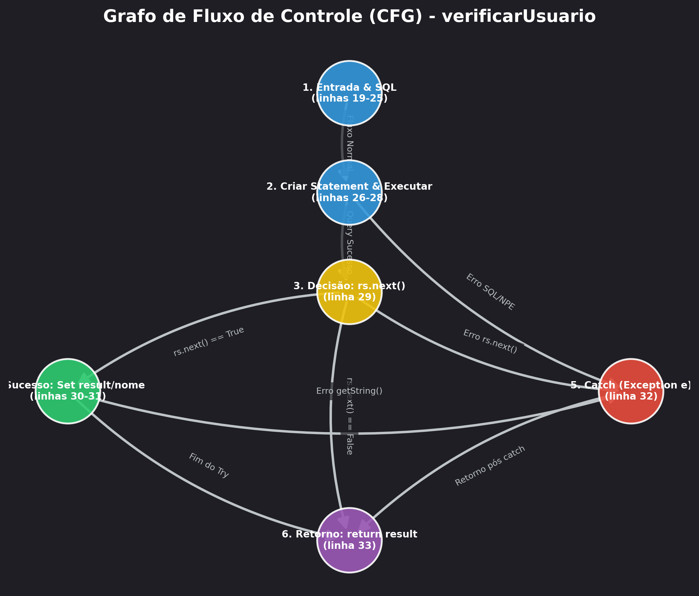
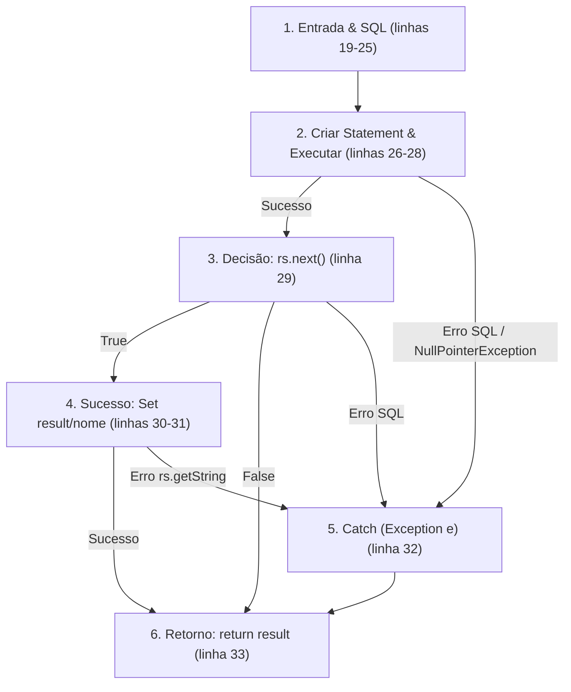

# Relatório Técnico: Teste de Caixa Branca e Análise Estrutural em Java

Este repositório contém a entrega da atividade prática sobre **Teste de Caixa Branca**, **Análise Estática de Código** e **Modelagem de Fluxo de Execução** desenvolvida para a disciplina de Qualidade e Teste de Software.

---

## 1. Introdução

O objetivo desta atividade é realizar uma análise estrutural detalhada e uma revisão estática completa em um código de autenticação em Java que se conecta a um banco de dados MySQL. A partir do código original (apresentado em formato de imagem), foi realizada a reprodução fiel da implementação original, uma inspeção minuciosa de falhas/vulnerabilidades, a modelagem de seu Grafo de Fluxo de Controle (CFG), o cálculo de sua Complexidade Ciclomática e a definição de seus caminhos básicos de execução.

Após a análise, foi desenvolvida uma versão revisada da classe, aplicando as melhores práticas de mercado (Clean Code, segurança defensiva contra SQL Injection, prevenção de NullPointerException, tratamento correto de exceções e eliminação de concorrência), validando o comportamento de ambas as versões por meio de testes automatizados com mocks dinâmicos do JDBC.

---

## 2. Análise Estática do Código (Caixa Branca)

A análise estática detalhada das 10 perguntas obrigatórias foi realizada e consolidada na planilha [PLANO DE TESTE.xlsx](file:///c:/Users/duduf/TesteCaixaBranca/PLANO%20DE%20TESTE.xlsx) na aba **CAIXA BRANCO (ESTÁTICO)**. A seguir está a fundamentação técnica das descobertas:

*   **Documentação**: O código original carece totalmente de documentação (como Javadoc ou comentários estruturados). Existem apenas anotações residuais irrelevantes como `//INSTRUÇÃO SQL` e `//fim da class`. Isso dificulta a manutenção e a legibilidade.
*   **Nomenclatura**: Há uma inconsistência de idioma (nomenclatura híbrida). A classe é denominada em inglês (`User`, `Connection`, `result`), enquanto os métodos e pacotes utilizam português (`conectarBD`, `verificarUsuario`). Além disso, a variável global `result` possui um nome genérico que não descreve claramente sua função de autenticação (`isAuthenticated` seria preferível).
*   **Legibilidade**: A formatação do código viola severamente as convenções do Java (Oracle/Sun). O fechamento de chaves na mesma linha (ex: `}catch (Exception e) { } return conn;}`) e a falta de alinhamento vertical diminuem a escaneabilidade do código.
*   **Riscos de NullPointerException**: Altíssimo risco. O método `conectarBD()` captura exceções de forma genérica e retorna `null` caso falhe. Ao chamar `conn.createStatement()` na linha 27 sem verificar se a variável `conn` é nula, um `NullPointerException` é lançado imediatamente se o banco estiver inacessível ou o driver incorreto.
*   **Fechamento de Conexões e Recursos**: O código apresenta um vazamento crônico de recursos (*Resource Leak*). Os recursos JDBC fundamentais (`Connection`, `Statement` e `ResultSet`) nunca são fechados por meio do método `.close()`, podendo levar à exaustão do pool de conexões do banco de dados e à degradação de memória (*OutOfMemoryError*).
*   **Vulnerabilidades e Segurança**:
    1.  **SQL Injection (Grave)**: O método `verificarUsuario` concatena diretamente as variáveis `login` e `senha` na string SQL (`sql += ... + login + ...`). Um invasor pode burlar a autenticação facilmente fornecendo payloads como `' OR '1'='1` nos parâmetros.
    2.  **Hardcoded Credentials**: A URL de conexão possui credenciais explícitas (`user=lopes&password=123`), facilitando o vazamento de dados por engenharia reversa.
    3.  **Senhas em texto limpo**: A verificação compara a senha diretamente na query, indicando que as senhas estão salvas sem hash no banco.
*   **Tratamento de Exceções**: A utilização de blocos catch vazios (`catch (Exception e) { }`) mascara problemas de runtime, ocultando falhas críticas de conexão, erros de sintaxe SQL ou erros de driver, impossibilitando diagnósticos.
*   **Redundâncias e Más Práticas**: O uso de `Class.forName("...").newInstance()` é obsoleto a partir do Java 9. Além disso, a inicialização e concatenação sequencial da query SQL (`sql = ""`, `sql += ...`) é ineficiente.
*   **Riscos Estruturais**: As variáveis de estado `nome` e `result` são declaradas como propriedades de instância públicas e mutáveis da classe `User`. Se a mesma instância for usada em um ambiente web/concorrente por múltiplos usuários, as requisições concorrentes irão sobrescrever os dados mutuamente, gerando uma brecha crítica onde um usuário pode ver o nome de outro ou obter acesso indevido.

---

## 3. Grafo de Fluxo

Abaixo está o **Grafo de Fluxo de Controle (CFG)** modelado para a lógica interna do método `verificarUsuario(login, senha)` da classe original:

### Notação do Grafo em Mermaid (Texto)

### Explicação dos Fluxos e Nós:
*   **Nó 1**: Ponto de entrada do método `verificarUsuario`, inicialização da string SQL e chamada do método `conectarBD()`.
*   **Nó 2**: Bloco `try`. Criação do statement e envio da query para o banco de dados (`conn.createStatement()`, `st.executeQuery(sql)`). Se houver erro de banco ou a conexão for nula, o fluxo desvia para o Nó 5.
*   **Nó 3**: Ponto de decisão (`if (rs.next())`). Se a consulta retornar pelo menos um registro, desvia para o Nó 4. Se não encontrar registros, desvia para o Nó 6. Se houver falha de rede/banco ao iterar o result set, desvia para o Nó 5.
*   **Nó 4**: Atualização das variáveis globais `result = true` e extração do nome (`rs.getString("nome")`). Se houver falha ao extrair a coluna, desvia para o Nó 5.
*   **Nó 5**: Bloco catch genérico `catch (Exception e)`. Silencia o erro e o fluxo prossegue diretamente para a instrução de retorno no Nó 6.
*   **Nó 6**: Saída do método (`return result`).

---

## 4. Complexidade Ciclomática

A Complexidade Ciclomática mede o número de caminhos independentes em um grafo de controle de fluxo de um programa.

### Fórmula:
$$V(G) = E - N + 2P$$

Onde:
*   $E$ = Número de arestas (edges)
*   $N$ = Número de nós (nodes)
*   $P$ = Número de componentes conectados (geralmente $1$ para um único método)

### Demonstração do Cálculo:

A complexidade pode ser calculada sob duas perspectivas:

#### Cenário A: Grafo de Fluxo Simplificado (Sem caminhos de exceção implícitos)
Se ignorarmos as ramificações implícitas criadas pelas exceções do bloco `try-catch` e focarmos exclusivamente no fluxo linear e na decisão estrutural do `if`:
*   **Nós ($N$)**: 5 (Início/Query, Decisão `rs.next()`, Corpo do `if`, Catch, Retorno)
*   **Arestas ($E$)**: 5 (1->2, 2->3 (True), 2->5 (False), 3->5, 4->5)
*   **Cálculo**:
    $$V(G) = 5 - 5 + (2 \times 1) = 2$$

#### Cenário B: Grafo de Fluxo Completo (Considerando caminhos de exceção)
Ao mapear rigorosamente todas as ramificações onde falhas críticas podem ser disparadas (ex: falhas de SQL, erros de parsing e `NullPointerException`), obtemos o grafo modelado no item 3:
*   **Nós ($N$)**: 6
*   **Arestas ($E$)**: 9
*   **Cálculo**:
    $$V(G) = 9 - 6 + (2 \times 1) = 5$$

---

## 5. Caminhos Básicos Independentes

Com base no grafo completo (Complexidade Ciclomática $V(G) = 5$), identificamos 5 caminhos básicos independentes que cobrem todas as arestas do programa:

1.  **Caminho 1 (Sucesso na Autenticação)**:
    *   **Trajeto**: `1 -> 2 -> 3 -> 4 -> 6`
    *   **Explicação**: A conexão é bem-sucedida, a query SQL é executada sem erros, `rs.next()` retorna `true`, as variáveis são populadas e o método retorna `true`.
    *   **Caso de Teste associado**: Credenciais corretas enviadas para um banco de dados ativo com o usuário cadastrado.

2.  **Caminho 2 (Credenciais Incorretas / Usuário inexistente)**:
    *   **Trajeto**: `1 -> 2 -> 3 -> 6`
    *   **Explicação**: A conexão é bem-sucedida, a query é executada, mas `rs.next()` retorna `false` (usuário ou senha incorretos). O fluxo desvia para o retorno e devolve `false`.
    *   **Caso de Teste associado**: Passar login ou senha inexistentes/incorretos.

3.  **Caminho 3 (Exceção na criação do Statement / Conexão Nula)**:
    *   **Trajeto**: `1 -> 2 -> 5 -> 6`
    *   **Explicação**: Ocorre um erro crítico de conexão ou driver (ex: `NullPointerException` porque `conn` é nulo). O fluxo desvia no Nó 2 diretamente para o catch (Nó 5) e retorna `false` (valor padrão de `result`).
    *   **Caso de Teste associado**: Banco de dados offline ou credenciais de conexão do banco de dados erradas.

4.  **Caminho 4 (Exceção na iteração do ResultSet)**:
    *   **Trajeto**: `1 -> 2 -> 3 -> 5 -> 6`
    *   **Explicação**: A query é executada com sucesso, mas ocorre uma falha de rede/banco na chamada do método `rs.next()`. O fluxo é desviado para o catch (Nó 5) e retorna `false`.
    *   **Caso de Teste associado**: Perda abrupta de conectividade de rede com o banco durante a iteração da resposta.

5.  **Caminho 5 (Exceção ao extrair o valor da coluna "nome")**:
    *   **Trajeto**: `1 -> 2 -> 3 -> 4 -> 5 -> 6`
    *   **Explicação**: A query é bem-sucedida, `rs.next()` retorna `true`, mas ocorre uma falha ao tentar ler o valor (`rs.getString("nome")`), por exemplo, caso a coluna "nome" não exista na tabela do banco de dados. O catch captura a exceção e retorna `false`.
    *   **Caso de Teste associado**: Banco de dados com a estrutura de tabela modificada (coluna "nome" ausente).

---

## 6. Melhorias Implementadas no Código Revisado

A classe corrigida [UserRevised.java](file:///c:/Users/duduf/TesteCaixaBranca/src/login/UserRevised.java) traz as seguintes soluções de melhoria:

1.  **Prevenção contra SQL Injection**: Uso de `PreparedStatement` com parâmetros delimitados por `?` ao invés de concatenação manual de strings. O próprio driver JDBC lida com a sanitização das entradas.
2.  **Tratamento de Conexão Nula**: Inserção de validação defensiva `if (conn == null)` para evitar que o código tente operar sobre um objeto nulo, impedindo falhas brutas de `NullPointerException`.
3.  **Fechamento Seguro de Recursos**: Utilização do padrão **Try-with-resources** do Java. Este recurso garante que a conexão (`Connection`), a query compilada (`PreparedStatement`) e o leitor (`ResultSet`) sejam automaticamente encerrados ao final do bloco, mesmo em casos de exceção.
4.  **Thread-Safety (Concorrência)**: Remoção das variáveis globais de estado `nome` e `result` no escopo da classe. Em vez disso, o método retorna uma instância imutável da classe estática interna `AuthResult` (DTO/Record). Múltiplas threads simultâneas agora executam de forma isolada.
5.  **Logging**: Remoção de catches silenciosos. Agora as falhas e erros de conexões são devidamente monitorados e catalogados usando a API `java.util.logging.Logger`.
6.  **Desacoplamento e Testabilidade**: Permite a injeção de parâmetros de conexão de banco por meio de construtor parametrizado ou propriedades de sistema, removendo chaves hardcoded e facilitando a automação de testes com mock da conexão.

---

## 7. Conclusão

*   **Importância do Teste Estrutural**: O teste estrutural (caixa branca) permite a análise profunda das linhas do código, permitindo que vulnerabilidades e más práticas que passariam despercebidas em testes puramente funcionais de caixa preta sejam encontradas antes de irem para produção.
*   **Dificuldades Encontradas**: Mapear detalhadamente os caminhos de execução envolvendo tratamentos excepcionais implicitamente criados por APIs como JDBC exige atenção rigorosa a fim de não negligenciar cenários onde blocos catch vazios alteram o fluxo final.
*   **Impacto da Revisão**: A revisão de código (Code Review) somada à análise estática resultou em um sistema significativamente mais robusto, eliminando o potencial de vazamento de recursos e isolando as sessões de usuários de maneira segura para ambientes web de alta concorrência.
*   **Qualidade de Software**: A aplicação sistemática de testes e revisões garante que o software não seja apenas funcional, mas seguro, escalável, legível e mantível a longo prazo, diminuindo exponencialmente o custo técnico de correção de bugs em produção.
